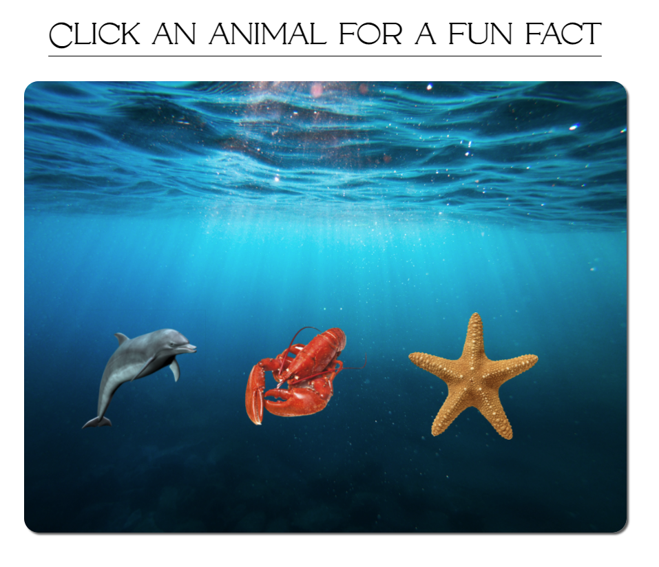
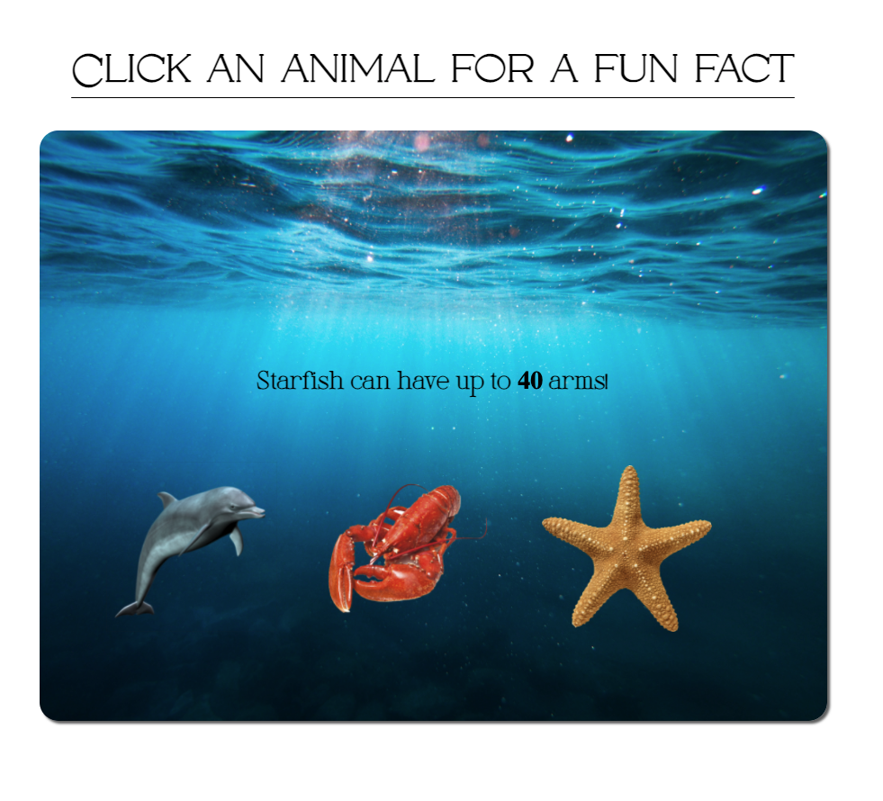

# Animal Fun Facts

A simple web app that allows users to click on an animal on the screen and have a fun fact popup.

## Technologies Used
* HTML 
* CSS 
* JavaScript
* React

## User Story
As a user I want to be able to click on an animal and see a fun fact appear on the screen.

## Working App

## Getting Started
* [Click here](https://heuristic-mestorf-88ff39.netlify.app/) to see the deployed app